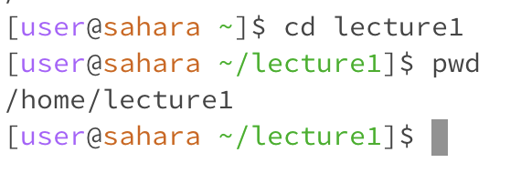
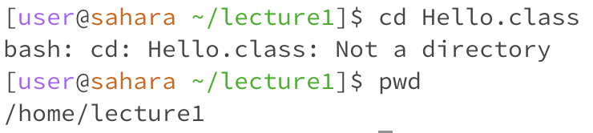
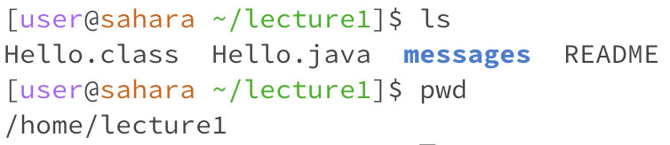
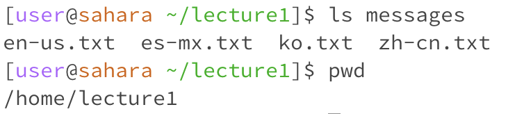
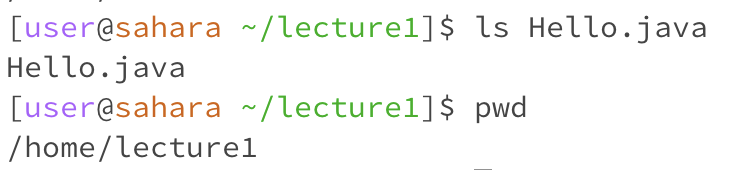
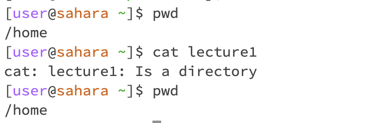
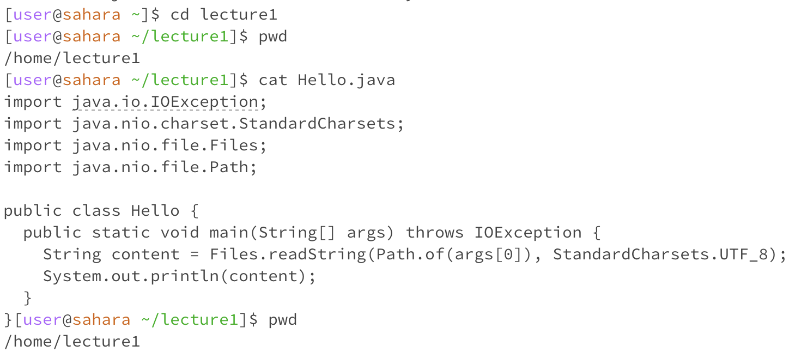

**Command `cd`**
1. Share an example of using the command with no arguments.

- The working directory when the command was run is /home/lecture1.
- The output I got was the working directory /home and I got this output because I ran cd with no arguments which takes me back to the home directory.
- This output is not an error.
2. Share an exmaple of using the command with a path to a directory as an argument.

- The working directory when the command was run is /home
- The reason why the working directory became /home/lecture1 is because the command was ran with the argument lecture1 changing the directory to lecture1.
- The output is not an error.
3. Share an example of using the command with a path to a file as an argument.

- The working directory when the command was run is /home/lecture1.
- The output received is "bash: cd: Hello.class: Not a directory". This output was received because the command cd can only be used to change the working directory.
- The output is an error because the working directory was not changed since Hello.class is a file and not a directory.

**Command `ls`**
1. Share an example of using the command with no arguments

- The working directory when the command was run is /home/lecture1.
- The reason I got the output in the screenshot is because the command ls displays all the files and folders in the working directory.
- The output is not an error.
2. Share an exmaple of using the command with a path to a directory as an argument.

- The working directory when the command was run is /home/lecture1.
- The reason I got the output in the screenshot is because the command shows the files in the directory, but does not change the working directory.
- The output is not an error.
3. Share an example of using the command with a path to a file as an argument.

- The working directory when the command was run is /home/lecture1.
- The reason I got Hello.java as the output is because the command shows the files and folders in a directory, because Hello.java is a file, Hello.java was returned.
- The output is not an error.

**Command `cat`**
1. Share an example of using the command with no arguments.

- The working directory when the command was run is /home
- The output I got was a blank line initially, but after typing "hello world" and pressing enter, hello world is returned. This happened because the cat command reads the data from the standard input and returns the standard output.
- The output is not an error.
2. Share an exmaple of using the command with a path to a directory as an argument.

- The working directory when the command was run is /home
- The output I got was "cat: lecture1: is a directory" because cat prints the contents from a file, but lecture 1 is a directory.
- The output is an error because cat prints the contents of a file, but the argument is a directory.
3. Share an example of using the command with a path to a file as an argument.

- The working directory when the command was run is /home/lecture1
- The output I got was the contents in Hello.java as its standard output because cat returns the the contents from a file as its standard output.
- The output is not an error.
