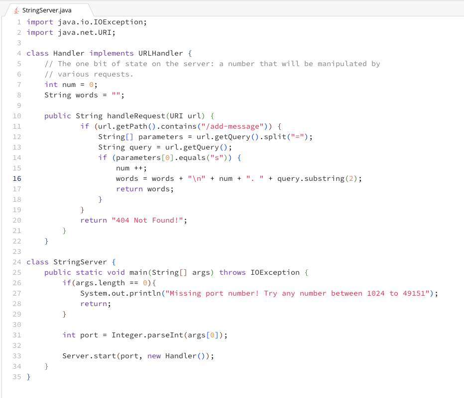
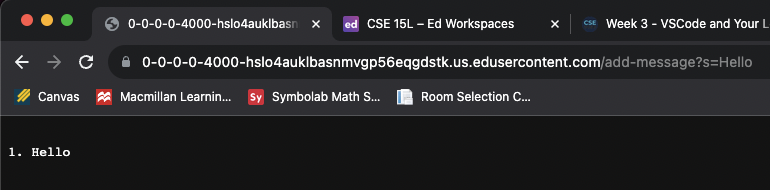
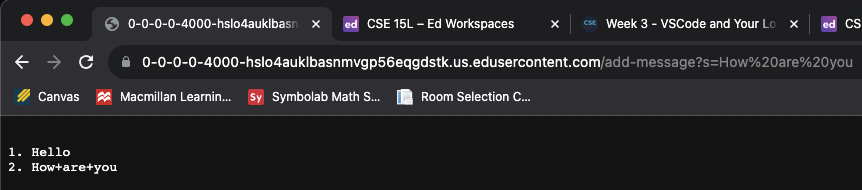
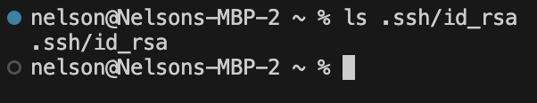
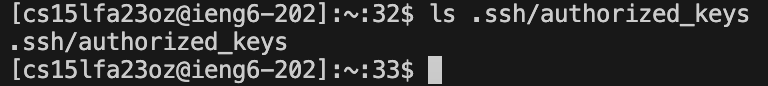
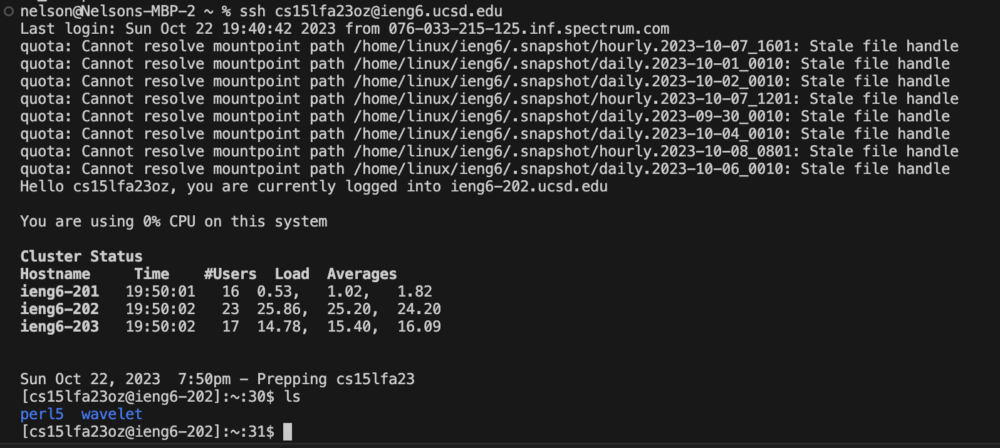

**Part 1**

1. **Screenshot 1 of `/add-message`**

- The method called in my code is handleRequest
- The relevant arguments to that method is that the url path contains "/add-message" and the query parameter equaling "s". The values of relevant fields of the class are adding 1 to num which tracks the number of the message and "Hello" which is added to the words string.
- The value of the words string changes from this request because "Hello" is added to the string which contains all the strings added and num increases by 1.

2. **Screenshot 2 of `/add-message`**

- The method called in my code is handleRequest
- The relevant argument to handleRequest is also the url path that contains "/add-message" and the query parameter equals "s". The values of relevant fields of the classs are increasing num by 1 and "How are you" which is added to the words string.
- The value of the words string is updated to contain "How are you" which stores all the strings and num increases by 1.

**Part 2**

- `ls` Path to private key

- `ls` Path to public key

- Terminal Interaction with login to ieng6 and `ls`

**Part 3**

Something I learned from lab in week 3 that I did not know before was how to setup my remote account to not need a password to login. This was done by creating a public SSH key. Then creating a directory in the remote account to hold the public key. After, I used the `scp` command to securely copy the public SSH key from my computer to the remote account.
