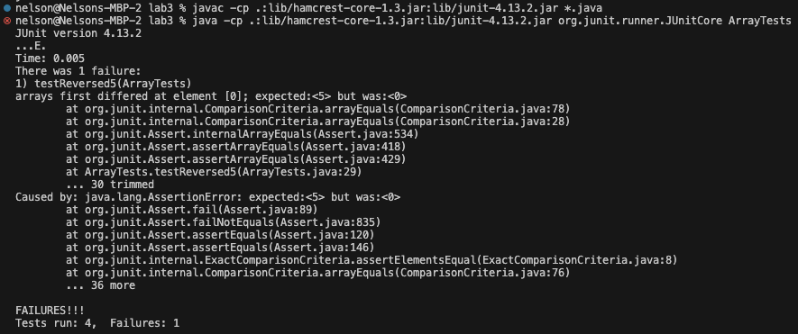

**Part 1**

- A failure-inducing input for the buggy program, as a JUnit test and any associated code
```
  @Test
  public void testReversed5() {
    int[] input1 = { 1,2,3,4,5};
    assertArrayEquals(new int[]{5,4,3,2,1 }, ArrayExamples.reversed(input1));
  }
```

- An input that doesn’t induce a failure, as a JUnit test and any associated code
```
  @Test
  public void testReversed() {
    int[] input1 = { };
    assertArrayEquals(new int[]{ }, ArrayExamples.reversed(input1));
  }
```

- The symptom, as the output of running the tests
  

- The bug, before the code change
```
    static int[] reversed(int[] arr) {
    int[] newArray = new int[arr.length];
    for(int i = 0; i < arr.length; i += 1) {
      arr[i] = newArray[arr.length - i - 1];
    }
    return arr;
  }
```

- The fix, after the code change
```
    static int[] reversed(int[] arr) {
    int[] newArray = new int[arr.length];
    for(int i = 0; i < arr.length; i += 1) {
      newArray[i] = arr[arr.length - i - 1];
    }
    return newArray;
  }
```

**Why does the fix address the issue?**
- Prior to the fix, the code was buggy because the reversed method created a new empty array with the size of the input array. Then, the method copies over the reverse order of the array onto the main array, however each index of newArray is just 0 because the array is empty. The fix copies over the elements from the input array in reverse order to the new Array, then returns the new Array.

