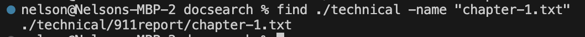
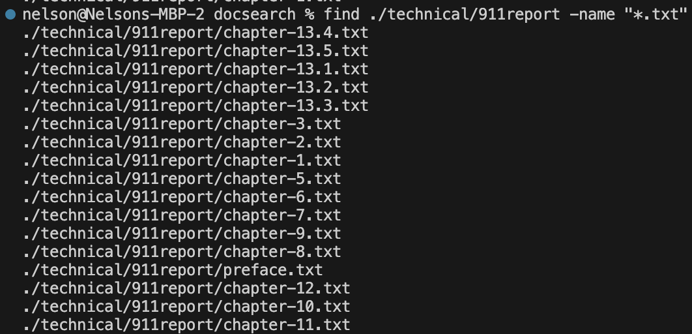
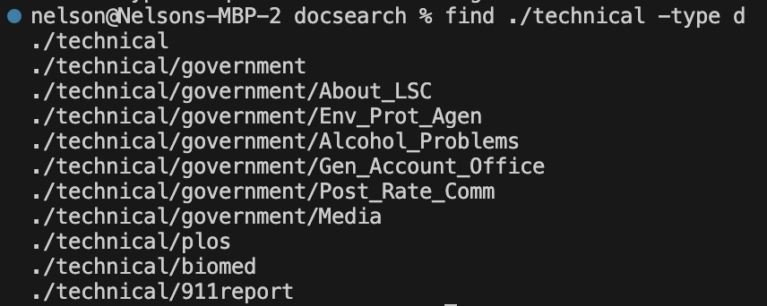
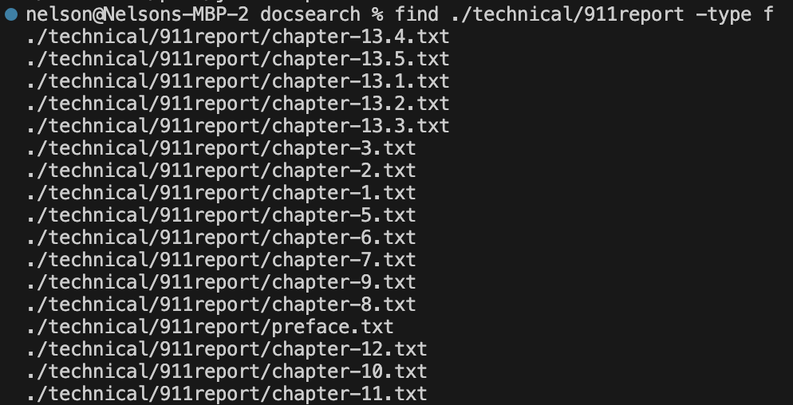
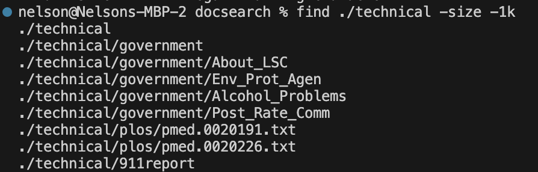
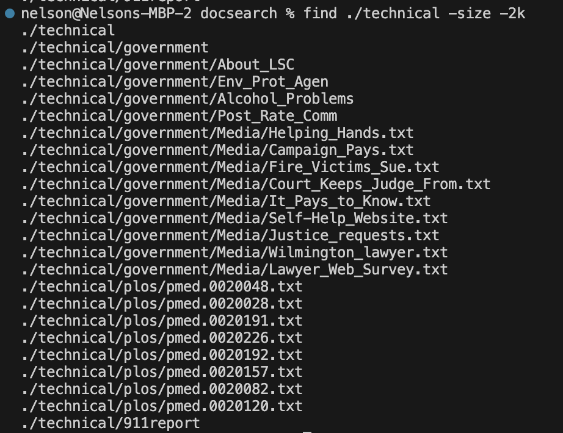
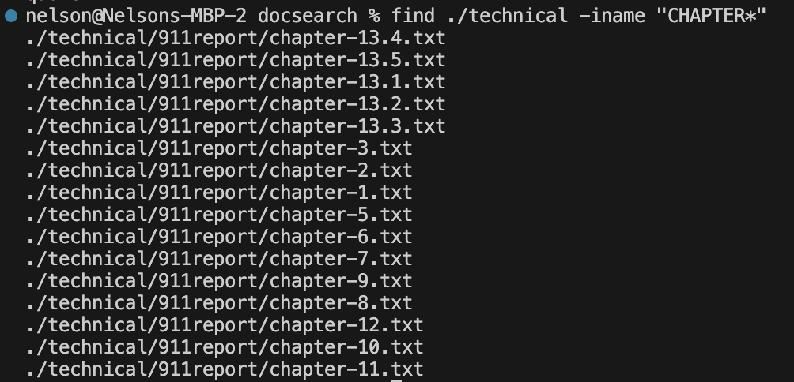
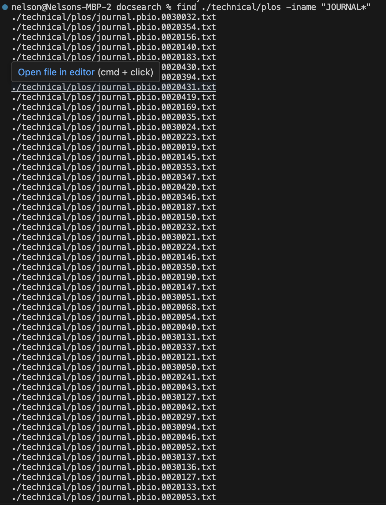

**Part 1**

- A failure-inducing input for the buggy program, as a JUnit test and any associated code
```
  @Test
  public void testReversed5() {
    int[] input1 = { 1,2,3,4,5};
    assertArrayEquals(new int[]{5,4,3,2,1 }, ArrayExamples.reversed(input1));
  }
```

- An input that doesn’t induce a failure, as a JUnit test and any associated code
```
  @Test
  public void testReversed() {
    int[] input1 = { };
    assertArrayEquals(new int[]{ }, ArrayExamples.reversed(input1));
  }
```

- The symptom, as the output of running the tests
  

- The bug, before the code change
```
    static int[] reversed(int[] arr) {
    int[] newArray = new int[arr.length];
    for(int i = 0; i < arr.length; i += 1) {
      arr[i] = newArray[arr.length - i - 1];
    }
    return arr;
  }
```

- The fix, after the code change
```
    static int[] reversed(int[] arr) {
    int[] newArray = new int[arr.length];
    for(int i = 0; i < arr.length; i += 1) {
      newArray[i] = arr[arr.length - i - 1];
    }
    return newArray;
  }
```

**Why does the fix address the issue?**
- Prior to the fix, the code was buggy because the reversed method created a new empty array with the size of the input array. Then, the method copies over the reverse order of the array onto the main array, however each index of newArray is just 0 because the array is empty. The fix copies over the elements from the input array in reverse order to the new Array, then returns the new Array.


**Part 2**

`find -name`
I discovered this command using `man find`


- In this example, the command is finding files with the corresponding name "chapter-1.txt". This is useful when you do not know what directory your file is in and you would like to look for it.


- In this example, the command is finding files with any name and .txt in the file name. This is useful when you want to find files with a certain character or word in it.

`find -type`
I discovered this command using `man find`


- In this example, the command is finding the directories within the directory provided. This is useful for searching for directories within a directory.


- In this example, the command is finding the files within the directory provided. This is useful for searching for files within a directory.

`find -size`
I discovered this command using `man find`


- In this example, the command is finding files that are less than 1kb in size within the directory provided. This is useful for searching for files that are less than 1 kb.


- In this example, the command is finding files that are less than 2kb in size within the directory provided. This is useful for searching for files that are less than 2 kb.

`find -iname`
I discovered this command using `man find`



- In this example, the command is finding files that have "CHAPTER" in the name regardless of capitalization in the directory provided. This is useful for looking for files that you do not remember if they were capitalized.



- In this example, the command is finding files with "JOURNAL" in the name regardless of capitalization in the directory provided. This is useful for looking for files that you do not remember if they were capitalized and containing specific characters/words.
