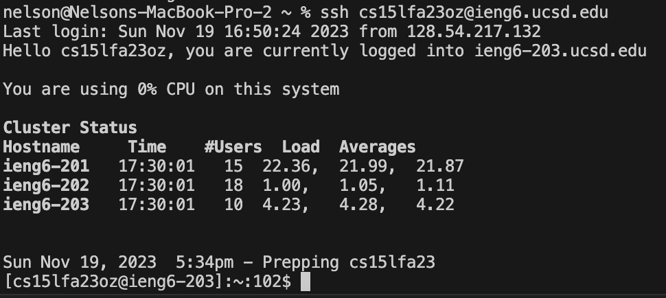
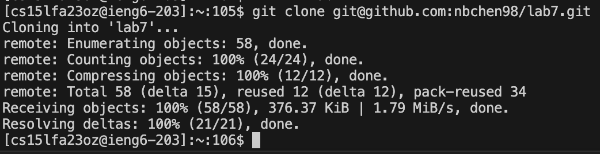
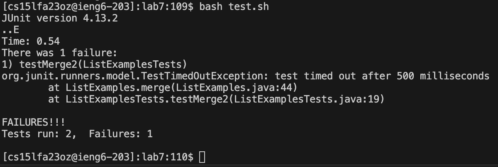
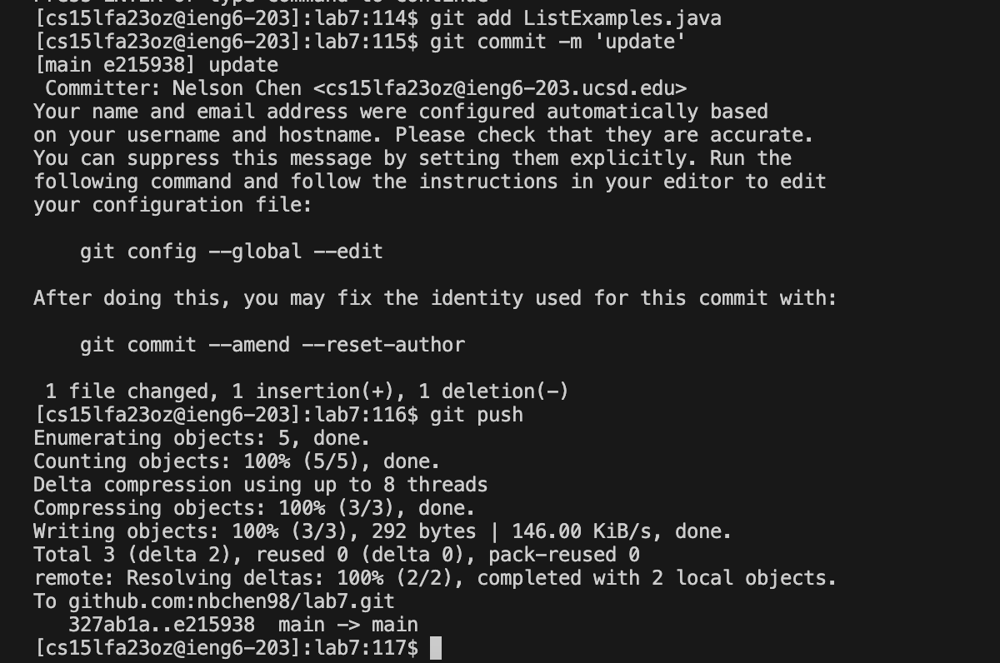
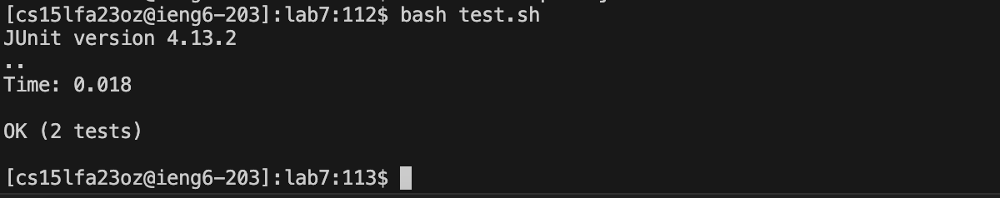

- **Step 1: Log into ieng6**

- To login to ieng6 I typed `ssh <ctrl><v><enter>`. This command just logs into ieng6 and the effect of the keypresses were typing out ssh and pasting my ieng6, then running the command.

- **Step 2: Clone your fork of the repository from your Github account (using the SSH URL)**

- To clone the fork of my respository using the ssh url, I typed `git clone <ctrl><v><enter>`. This command clones the fork of the repository from my github account onto the remote computer. The effect of the keypresses were typing out git clone and pasting the SSH url, then running the command.

- **Step 3: Run the tests, demonstrating that they fail**

- To run the tests, first I typed the command `cd lab7<enter>`. This command changes the directory to lab7, the effect of the keypresses were typing out the command and running the command.
- Next, I typed `bash test.sh <enter>`, This command runs the test.sh script which runs the test files. The effect of the keypresses were typing out the command and running the command.

- **Step 4: Edit the code file ListExamples.java to fix the failing test (as a reminder, the error in the code is just that index1 is used instead of index2 in the final loop in merge)**

- To fix the failing test, I edited the code in the ListExamples.java file by typing `vim ListExamples.java <enter>`. This command opens the file in the terminal allowing me to view it and the effect of the keypresses were typing out the command and running the command. Next I pressed `<up><up><right><right><right><right><right><right><right><right><i><delete><2><esc>`. The effect of these keypresses are moving the cursor, then editing the code to change index1 to index2. Finally, I typed `:wq <enter>`. This command saves and closes the file and the effect of the keypresses were typing the command and running the command.

- **Step 5: Run the tests, demonstrating that they now succeed**

- To run the tests, I typed `bash test.sh <enter>`. This command runs the test.sh script which runs the test files and the effect of the keypresses were typing out the command and running the command.

- **Step 6: Commit and push the resulting change to your Github account**

- First, I typed `git add ListExamples.java <enter>`. This command adds the changed file to the commit request and the effect of the keypresses were typing out the command and running the command. Next I typed `git commit -m 'update' <enter>`, This command commits the changed file to my github account with the message 'update' and the effect of the keypresses were typing the command and running the command. Finally, I typed `git push <enter>`, this command pushes the changes to my github account and the effect of the keypresses were typing out the command and running the command.

Time: 2 minutes and 22 seconds.
