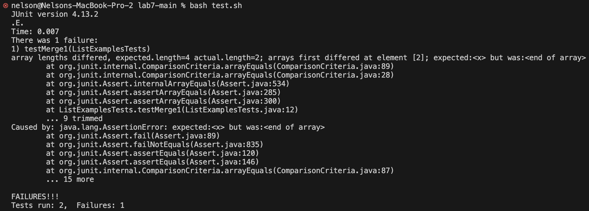
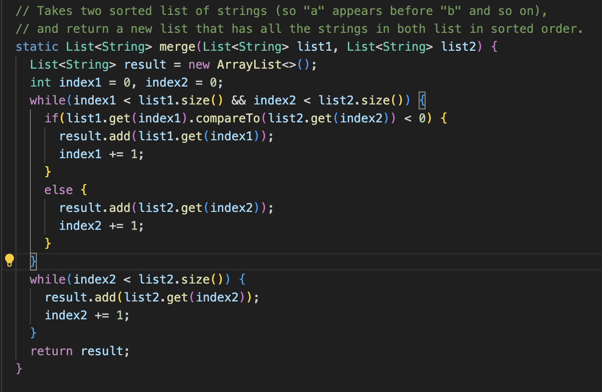
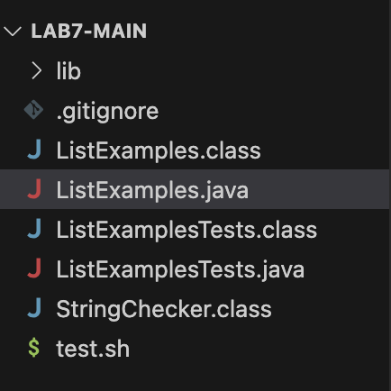
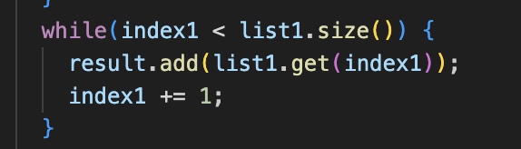

**Part 1 - Debugging Scenario**

1. **Student:** Hello, I was testing ListExamples.java from the week 7 lab, but I am getting this error in the tests where the expected array length differs from the actual array length. I am guessing there is an issue when adding elements back to the array. 

 

2. **TA:** Hello, check to make sure that your merge method properly adds elements of both arrays into the final array.

3. 
There is no while loop that adds the elements from list1 to the final array.

4.The file needed to fix the bug is ListExamples.java which is in the lab7-main directory.
Entire directory structure: 
Contents of file before fixing bug: 
Full command ran to trigger bug: bash test.sh
A description of what to edit to fix the bug: In ListExamples.java, the merge method was missing a while loop that adds elements from the initial array to the final array. So this was implemented in the merge method 

**Part 2 - Reflection** 
Something I learned in my lab experience in the second half of the quarter was using vim. I thought using vim was cool because it allowed me to make changes to files in terminal without using an IDE. Therefore, now that I know vim it enables me to make changes to files when using ieng6 or whenever I can not use an IDE.
